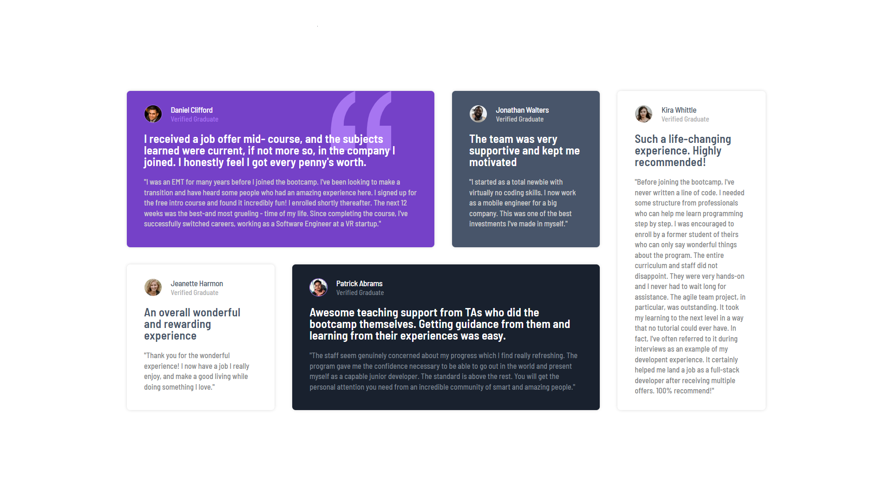

# Frontend Mentor - Testimonials grid section

This is my solution to the [Frontend Mentor "Testimonials grid section" challenge](https://www.frontendmentor.io/challenges/testimonials-grid-section-Nnw6J7Un7).

I can see live on this [Vercel page](https://josuesn1402-testimonials-grid-section.vercel.app/).

## Table of Contents

- [Frontend Mentor - Testimonials grid section](#frontend-mentor---testimonials-grid-section)
  - [Table of Contents](#table-of-contents)
  - [Screenshots](#screenshots)
  - [Features](#features)
  - [Built with](#built-with)
  - [Instruction](#instruction)

## Screenshots



## Features

- Used CSS Modules with SASS

## Built with

<div align='center'>
    <a href='https://vitejs.dev/'>
        
    </a>
    <a href='https://reactjs.org/'>
        
    </a>
    <a href='https://sass-lang.com/'>
        
    </a>
</div>

## Instruction

- Clone repository

```git
git clone git@github.com:josuesn1402/Testimonials-grid-section.git
```

- Install dependencies

```yarn
yarn install
```

- Run dev server

```yarn
yarn dev
```